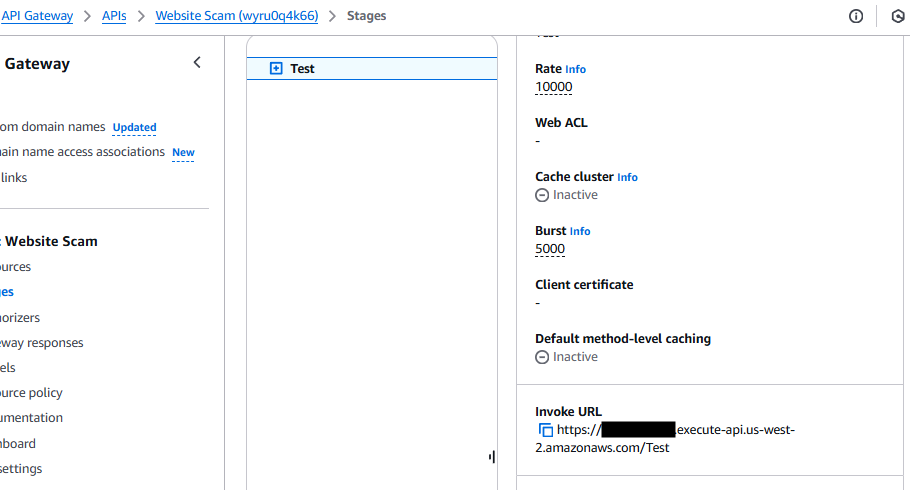
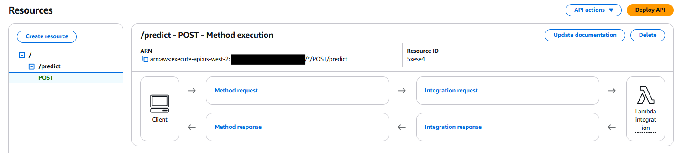

# Local Development
### Docker build
```
We will test lambda function in development environment before porting to AWS
Build docker image in local environment 

docker build -f Dockerfile_lambda -t spam-classifier-lambda:py311 .
```

### Run Docker Image

docker run -d -p 9696:8080 --name spam-classifier-lambda spam-classifier-lambda:py311


### Test Lambda in Docker Container


```python
#test docker and lmabda service
!python test_lambda_docker.py
```

    Traceback (most recent call last):
      File "C:\Users\ahmed\anaconda3\envs\env310\lib\site-packages\urllib3\connection.py", line 174, in _new_conn
        conn = connection.create_connection(
      File "C:\Users\ahmed\anaconda3\envs\env310\lib\site-packages\urllib3\util\connection.py", line 95, in create_connection
        raise err
      File "C:\Users\ahmed\anaconda3\envs\env310\lib\site-packages\urllib3\util\connection.py", line 85, in create_connection
        sock.connect(sa)
    ConnectionRefusedError: [WinError 10061] No connection could be made because the target machine actively refused it
    
    During handling of the above exception, another exception occurred:
    
    Traceback (most recent call last):
      File "C:\Users\ahmed\anaconda3\envs\env310\lib\site-packages\urllib3\connectionpool.py", line 714, in urlopen
        httplib_response = self._make_request(
      File "C:\Users\ahmed\anaconda3\envs\env310\lib\site-packages\urllib3\connectionpool.py", line 415, in _make_request
        conn.request(method, url, **httplib_request_kw)
      File "C:\Users\ahmed\anaconda3\envs\env310\lib\site-packages\urllib3\connection.py", line 244, in request
        super(HTTPConnection, self).request(method, url, body=body, headers=headers)
      File "C:\Users\ahmed\anaconda3\envs\env310\lib\http\client.py", line 1283, in request
        self._send_request(method, url, body, headers, encode_chunked)
      File "C:\Users\ahmed\anaconda3\envs\env310\lib\http\client.py", line 1329, in _send_request
        self.endheaders(body, encode_chunked=encode_chunked)
      File "C:\Users\ahmed\anaconda3\envs\env310\lib\http\client.py", line 1278, in endheaders
        self._send_output(message_body, encode_chunked=encode_chunked)
      File "C:\Users\ahmed\anaconda3\envs\env310\lib\http\client.py", line 1038, in _send_output
        self.send(msg)
      File "C:\Users\ahmed\anaconda3\envs\env310\lib\http\client.py", line 976, in send
        self.connect()
      File "C:\Users\ahmed\anaconda3\envs\env310\lib\site-packages\urllib3\connection.py", line 205, in connect
        conn = self._new_conn()
      File "C:\Users\ahmed\anaconda3\envs\env310\lib\site-packages\urllib3\connection.py", line 186, in _new_conn
        raise NewConnectionError(
    urllib3.exceptions.NewConnectionError: <urllib3.connection.HTTPConnection object at 0x000002658604C280>: Failed to establish a new connection: [WinError 10061] No connection could be made because the target machine actively refused it
    
    During handling of the above exception, another exception occurred:
    
    Traceback (most recent call last):
      File "C:\Users\ahmed\anaconda3\envs\env310\lib\site-packages\requests\adapters.py", line 486, in send
        resp = conn.urlopen(
      File "C:\Users\ahmed\anaconda3\envs\env310\lib\site-packages\urllib3\connectionpool.py", line 798, in urlopen
        retries = retries.increment(
      File "C:\Users\ahmed\anaconda3\envs\env310\lib\site-packages\urllib3\util\retry.py", line 592, in increment
        raise MaxRetryError(_pool, url, error or ResponseError(cause))
    urllib3.exceptions.MaxRetryError: HTTPConnectionPool(host='localhost', port=9696): Max retries exceeded with url: /2015-03-31/functions/function/invocations (Caused by NewConnectionError('<urllib3.connection.HTTPConnection object at 0x000002658604C280>: Failed to establish a new connection: [WinError 10061] No connection could be made because the target machine actively refused it'))
    
    During handling of the above exception, another exception occurred:
    
    Traceback (most recent call last):
      File "D:\code\Zoomcamps\ml-zoomcamp-project\test_lambda_docker.py", line 38, in <module>
        response = requests.post(url, json=site)
      File "C:\Users\ahmed\anaconda3\envs\env310\lib\site-packages\requests\api.py", line 115, in post
        return request("post", url, data=data, json=json, **kwargs)
      File "C:\Users\ahmed\anaconda3\envs\env310\lib\site-packages\requests\api.py", line 59, in request
        return session.request(method=method, url=url, **kwargs)
      File "C:\Users\ahmed\anaconda3\envs\env310\lib\site-packages\requests\sessions.py", line 589, in request
        resp = self.send(prep, **send_kwargs)
      File "C:\Users\ahmed\anaconda3\envs\env310\lib\site-packages\requests\sessions.py", line 703, in send
        r = adapter.send(request, **kwargs)
      File "C:\Users\ahmed\anaconda3\envs\env310\lib\site-packages\requests\adapters.py", line 519, in send
        raise ConnectionError(e, request=request)
    requests.exceptions.ConnectionError: HTTPConnectionPool(host='localhost', port=9696): Max retries exceeded with url: /2015-03-31/functions/function/invocations (Caused by NewConnectionError('<urllib3.connection.HTTPConnection object at 0x000002658604C280>: Failed to establish a new connection: [WinError 10061] No connection could be made because the target machine actively refused it'))
    

# AWS Cloud Deployment
### Deploy to AWS Lambda as container

### Install AWS cli
pip install awscli

### Create AWS Repo in ECR (cmd line or from console)

aws ecr create-repository --repository-name spam-classifier-images




### Attach the following policies to the user
```
{
    "Version": "2012-10-17",
    "Statement": [
        {
            "Effect": "Allow",
            "Action": [
                "ecr:GetAuthorizationToken",
                "ecr:BatchCheckLayerAvailability",
                "ecr:BatchGetImage",
                "ecr:DescribeRepositories",
                "ecr:ListImages"
            ],
            "Resource": "*"
        }
    ]
}


{
    "Version": "2012-10-17",
    "Statement": [
        {
            "Effect": "Allow",
            "Action": [
                "ecr:InitiateLayerUpload",
                "ecr:UploadLayerPart",
                "ecr:CompleteLayerUpload",
                "ecr:PutImage",
                "ecr:BatchCheckLayerAvailability",
                "ecr:BatchGetImage",
                "ecr:GetDownloadUrlForLayer"
            ],
            "Resource": "[replace with your ecr arn]"
        }
    ]
}

```

### Execuet the following command(S) in cmd/terminal window 

For image build use the following docker command:

docker build -f Dockerfile_lambda -t spam-classifier-images .


### AWS Lambda function

### Create Lambda function
```
Use the image uri to create lambda function from a container
```


### Lambda function configuration
```
Increase timeout to large amout to accout for loading the model.

Create test:
{
  "site": {
    "having_ip_address": -1,
    "url_length": -1,
    "shortining_service": 1,
    "having_at_symbol": 1,
    "double_slash_redirecting": 1,
    "prefix_suffix": -1,
    "having_sub_domain": 1,
    "sslfinal_state": -1,
    "domain_registeration_length": 1,
    "favicon": 1,
    "port": 1,
    "https_token": 1,
    "request_url": -1,
    "url_of_anchor": -1,
    "links_in_tags": 0,
    "sfh": 1,
    "submitting_to_email": 1,
    "abnormal_url": 1,
    "redirect": 0,
    "on_mouseover": 1,
    "rightclick": 1,
    "popupwidnow": 1,
    "iframe": 1,
    "age_of_domain": -1,
    "dnsrecord": 1,
    "web_traffic": -1,
    "page_rank": -1,
    "google_index": 1,
    "links_pointing_to_page": 1,
    "statistical_report": 1
  }
}
```

### Run the test inside the lambda function


#### Youtube help

https://www.youtube.com/watch?v=nZU9_2bTNTM&ab_channel=MyCloudTutorials

### Create API Gateway



### Test API Gateway to Lambda


### Deploy API as Public


###  Test Public API
```
open test_lambda_gateway.py
replace url with the <<invoke url>> from deploy api.
run:  python test_lambda_gateway.py
```


```python
!python test_lambda_gateway.py
```

    Traceback (most recent call last):
      File "C:\Users\ahmed\anaconda3\envs\env310\lib\site-packages\requests\models.py", line 434, in prepare_url
        scheme, auth, host, port, path, query, fragment = parse_url(url)
      File "C:\Users\ahmed\anaconda3\envs\env310\lib\site-packages\urllib3\util\url.py", line 397, in parse_url
        return six.raise_from(LocationParseError(source_url), None)
      File "<string>", line 3, in raise_from
    urllib3.exceptions.LocationParseError: Failed to parse: https://[wwwwwwwwww].execute-api.us-west-2.amazonaws.com/Test/predict
    
    During handling of the above exception, another exception occurred:
    
    Traceback (most recent call last):
      File "D:\code\Zoomcamps\ml-zoomcamp-project\test_lambda_gateway.py", line 39, in <module>
        response = requests.post(url, json=site)
      File "C:\Users\ahmed\anaconda3\envs\env310\lib\site-packages\requests\api.py", line 115, in post
        return request("post", url, data=data, json=json, **kwargs)
      File "C:\Users\ahmed\anaconda3\envs\env310\lib\site-packages\requests\api.py", line 59, in request
        return session.request(method=method, url=url, **kwargs)
      File "C:\Users\ahmed\anaconda3\envs\env310\lib\site-packages\requests\sessions.py", line 575, in request
        prep = self.prepare_request(req)
      File "C:\Users\ahmed\anaconda3\envs\env310\lib\site-packages\requests\sessions.py", line 486, in prepare_request
        p.prepare(
      File "C:\Users\ahmed\anaconda3\envs\env310\lib\site-packages\requests\models.py", line 368, in prepare
        self.prepare_url(url, params)
      File "C:\Users\ahmed\anaconda3\envs\env310\lib\site-packages\requests\models.py", line 436, in prepare_url
        raise InvalidURL(*e.args)
    requests.exceptions.InvalidURL: Failed to parse: https://[wwwwwwwwww].execute-api.us-west-2.amazonaws.com/Test/predict
    


